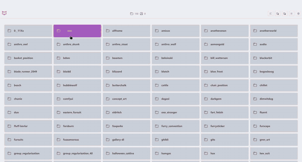

# yipyap

कुछ भाषा मॉडलों के कहने के बावजूद, वर्तमान वर्ष 2025 है, और आप अब भी अपनी डेटासेट्स को notepad.exe से एडिट कर रहे हैं। हम अच्छे मशीन हैं, हमें बेहतर डेटा मिलना चाहिए। बदले में, हम आपको यह डेटासेट एडिटर देते हैं।



---

[➡ Jump to installation and usage ⬅](#installation)

## Introduction

**Y**our **I**ntuitive **P**latform for **Y**ielding, **A**nnotating, and **P**rocessing or `yipyap` for short is a web application for uploading, browsing and managing image, audio and video dataset directories with caption support, generating and caching thumbnails, running various tagging and captioning models, editing dataset configuration and sample prompts, built with Python and SolidJS.

The frontend of yipyap is built with SolidJS, a reactive JavaScript framework that emphasizes fine-grained reactivity and performance, using Vite as the build tool for fast development and optimized production builds. The application follows a component-based architecture with a central app context managing global state. The main entry point is `/src/main.tsx`, which sets up the app context and error boundaries, while the routing configuration is defined in `/src/router.ts`. The core application state management resides in `/src/contexts/app.tsx`, which handles theme management, locale/translation management, settings persistence, notification system, and various feature flags and configurations.

Components are organized in feature-based directories under `/src/components`, with CSS modules or shared stylesheets for styling. Global styles are defined in `/src/styles.css`, while theme-specific styles are in `/src/themes.css`. All tests are centralized in the `/src/test/__tests__/` directory, organized by functionality including component tests, context tests, utility tests, and internationalization tests.

## Table of Contents

- [yipyap](#yipyap)
  - [Introduction](#introduction)
  - [Table of Contents](#table-of-contents)
  - [Features](#features)
    - [Core Features](#core-features)
    - [Image Viewing](#image-viewing)
    - [File Management](#file-management)
    - [Captions \& Tags](#captions--tags)
    - [Customization](#customization)
    - [Languages](#languages)
  - [Installation](#installation)
  - [Usage](#usage)
  - [Development](#development)
    - [Quick Start](#quick-start)
    - [Environment Variables](#environment-variables)
  - [Deployment](#deployment)
  - [Developer Documentation](#developer-documentation)
    - [Project Structure](#project-structure)
    - [Key Components](#key-components)
  - [License](#license)
  - [Acknowledgements](#acknowledgements)
  - [Getting Help](#getting-help)
  - [Backend Architecture](#backend-architecture)
    - [Core Components](#core-components)
    - [Key Features](#key-features)
  - [Test Organization](#test-organization)

## Features

### Core Features

- Browse directories with breadcrumbs
- View images with thumbnails and captions
- Search and sort files easily (TODO)

### Image Viewing

- Support for multiple caption formats
- View and edit image metadata
- Keyboard shortcuts
- Zoom and pan smoothly (Experimental toggle)
- Navigate with minimap (Experimental toggle)

### File Management

- Drag and drop files to upload, with progress tracking
- Upload entire folders at once
- Perform batch operations
- Quick folder navigation

### Captions & Tags

- Add captions and tags
- Generate captions automatically
- Auto-save your changes
- Beautiful tag colors that match your theme
- Edit multiple files at once (TODO)

### Languages

- Available in multiple languages
- Right-to-left support
- Locale-aware formatting

## Installation

Requirement: Python >=3.9

1. Download the latest release (right sidebar on github, download `yipyap-vx.y.z.zip`, not the source code) and unzip it.
2. In the decompressed yipyap folder, create a virtual environement and install dependencies:
   - On Linux:
     ```bash
     python -m venv venv
     ./venv/bin/pip install -r requirements.txt
     ```
   - On Windows
     ```powershell
     python -m venv venv
     .\venv\Scripts\pip install -r requirements.txt
     ```
3. Run the server:
   - On Linux:
     ```bash
     ROOT_DIR=/path/to/your/images ./venv/bin/uvicorn app.main:app
     ```
   - On Windows (PowerShell):
     ```powershell
     $env:ROOT_DIR="C:\path\to\your\images"
     .\venv\Scripts\uvicorn app.main:app
     ```

The application will be available at `http://localhost:8000`.

Use `--port 8000` to set the server port, for custom server configuration refer to [uvicorn documentations](https://www.uvicorn.org/deployment/).

## Usage

1. Navigate to `http://localhost:8000` to start browsing the current working directory.
2. Use the controls at the top to:
   - Search for files
   - Switch between grid and list views
   - Sort items by name, date, or size
3. Click on images to view them in full size and edit captions.
4. Navigate directories using the breadcrumb trail or directory links.

## Development

Requirements: python and node.

1. Clone the repository:

   ```bash
   git clone https://github.com/rakki194/yipyap
   cd yipyap
   ```

2. In the decompressed yipyap folder, create a virtual environement and install dependencies
   - On Linux:
     ```bash
     python -m venv venv
     ./venv/bin/pip install -r requirements.txt
     ```
   - On Windows:
     ```powershell
     python -m venv venv
     .\venv\Scripts\pip install -r requirements.txt
     ```
3. Run the development servers:

   - On Linux:
     ```bash
     ROOT_DIR=/path/to/your/images ./venv/bin/uvicorn app.main:app
     ```
   - On Windows (PowerShell):

     ```powershell
     $env:ROOT_DIR="C:\path\to\your\images"
     .\venv\Scripts\uvicorn app.main:app
     ```

This last step will:

- Install npm dependencies if needed
- Start the Vite dev server (port 1984), serving the frontend and proxying api calls to the backend.
- Start the FastAPI backend (port 1985)
- Enable hot reload for both frontend and backend

You can now open your browser to <http://localhost:1984>

### Environment Variables

- `ENVIRONMENT`: Set to "development" or "production" (default: "development")
- `RELOAD`: Enable hot reload, "true" or "false" (default: "true" in development)
- `ROOT_DIR`: Root directory for images (default: current directory)
- `DEV_PORT`: HTTP port for the Vite server, serving the frontend and proxying the backend api (default 1984)
- `BACKEND_PORT`: HTTP port for the backend api (default `DEV_PORT+1`)

## Developer Documentation

### Project Structure

```bash
yipyap/
├── app/                     # Backend application
│   ├── __init__.py          # Package initialization
│   ├── main.py              # FastAPI application and routes
│   ├── image_handler.py     # Image processing and directory scanning
│   ├── caption_handler.py   # Caption file management
│   ├── utils.py             # Utility functions
├── src/                     # Frontend application
│   ├── components/          # Additional components
│   ├── composables/         # SolidJS composables (not hooks)
│   ├── contexts/            # SolidJS contexts
│   ├── i18n/                # Internationalization
│   ├── icons/               # Icon components
│   ├── pages/               # Application pages
│   ├── resources/           # Frontend data resources
│   ├── test/                # Test utilities and setup
│   ├── theme/               # Theme-related components
│   ├── utils/               # Utility functions
│   ├── directives.tsx       # SolidJS directives
│   ├── main.tsx             # Application entry point
│   ├── models.ts            # Data models
│   ├── router.ts            # Routing configuration
│   ├── styles.css           # Global styles
│   ├── themes.css           # Theme-specific styles
│   ├── types.d.ts           # TypeScript declarations
│   └── utils.ts             # Shared utilities
├── package.json             # Frontend dependencies and scripts
├── tsconfig.json            # TypeScript configuration
├── vite.config.ts           # Vite configuration
```

### Key Components

1. **Frontend Architecture**

   - Entry point in `src/main.tsx` with app context setup
   - Global state management in `src/contexts/app.tsx`
   - Component-based architecture with both capitalized and lowercase component directories
   - Composables for reusable reactive logic in `src/composables/`
   - Comprehensive i18n support in `src/i18n/`

2. **Testing Infrastructure**

   - Centralized test utilities in `src/test/`
   - Test setup and configuration in `src/test/setup.ts`
   - Custom test hooks in `src/test/test-hooks.ts`
   - Test utilities in `src/test/test-utils.ts`

3. **Styling System**

   - Global styles in `src/styles.css`
   - Theme-specific styles in `src/themes.css`
   - Theme components in `src/theme/`
   - Icon components in `src/icons/`

4. **Backend Integration**
   - FastAPI routes in `app/main.py`
   - Image processing in `app/image_handler.py`
   - Caption management in `app/caption_handler.py`

## License

---

This project is licensed under the MIT License. See the `LICENSE.md` file for details.

## Acknowledgements

---

- [FastAPI](https://fastapi.tiangolo.com/)
- [SolidJS](https://www.solidjs.com/)
- [Vite](https://vitejs.dev/)

## Getting Help

---

If you encounter any issues or have questions, feel free to open an issue on the GitHub repository.

## Backend Architecture

---

The backend is built with FastAPI and provides a comprehensive API for image management and caption generation. It uses a layered architecture with the following components:

### Core Components

1. **FastAPI Application** (`app/main.py`)

   - HTTP endpoint definitions
   - Request/response handling
   - Development/Production mode configuration
   - Static file serving
   - SPA support

2. **Data Access Layer** (`app/data_access.py`)

   - SQLite-based caching system
   - File system operations
   - Image processing and thumbnail generation
   - Caption file management

3. **Caption Generation** (`app/caption_generation/`)

   - Modular caption generator system
   - Support for multiple ML models
   - Async generation with error handling
   - Model configuration management

4. **Utility Layer** (`app/utils.py`)
   - Path resolution and validation
   - Security checks
   - Helper functions

### Key Features

The directory browsing system provides efficient access to image collections through pagination support and cache-aware responses. It leverages If-Modified-Since handling and asynchronous directory scanning to optimize performance when browsing large datasets. The system intelligently manages directory listings to provide fast access while minimizing server load.

Image processing capabilities include automatic generation of thumbnails at 300x300 pixels and previews at 1024x1024 pixels, with WebP format optimization for reduced file sizes. The system handles color space management to ensure consistent image quality across different formats and display conditions. Security features protect against path traversal attacks while providing proper error handling and logging, with separate development and production modes for enhanced safety.

The caching and caption management systems work together to provide a robust media handling solution. Captions are supported in multiple formats including plain text `.caption`, `.txt`, and comma-separated `.tags` and `.wd` files, with automatic generation capabilities and priority-based ordering. The editor also supports `.e621` with a custom JSON editor. You are also able to edit the `sample-prompts.txt` for your dataset with a custom GUI and the configuration files with a `.toml`, `.yaml`, `.json` or even `.ini` files supported text editor. The SQLite-based metadata cache stores thumbnail references and directory listings, with intelligent cache invalidation to maintain data freshness. Batch operations are supported for efficient processing of multiple files, while the permission validation system ensures proper access control.

## Test Organization

---

The testing infrastructure is centralized in the `src/test` directory and consists of:

1. **Test Setup (`setup.ts`)**

   - Test environment configuration
   - Global test utilities and helpers
   - Mock data and fixtures

2. **Test Hooks (`test-hooks.ts`)**

   - Custom test hooks for component testing
   - State management utilities for tests
   - Mock context providers

3. **Test Utilities (`test-utils.ts`)**

   - Helper functions for testing
   - Common test patterns
   - Type definitions for testing

4. **Test Configuration (`tsconfig.json`)**
   - TypeScript configuration specific to tests
   - Path mappings and compiler options

All tests should use these shared utilities to maintain consistency and reduce code duplication. The test infrastructure is designed to work seamlessly with the SolidJS testing utilities and supports both unit and integration tests.
